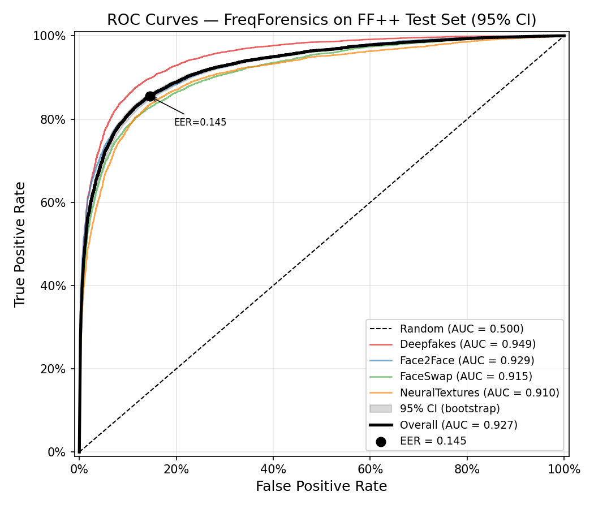
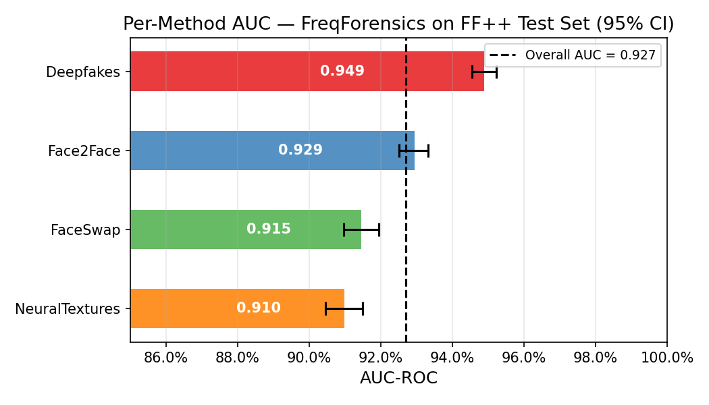
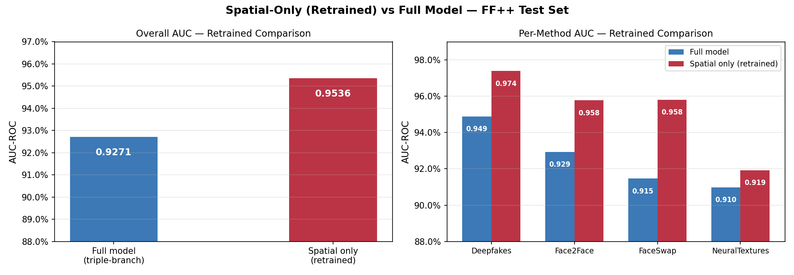
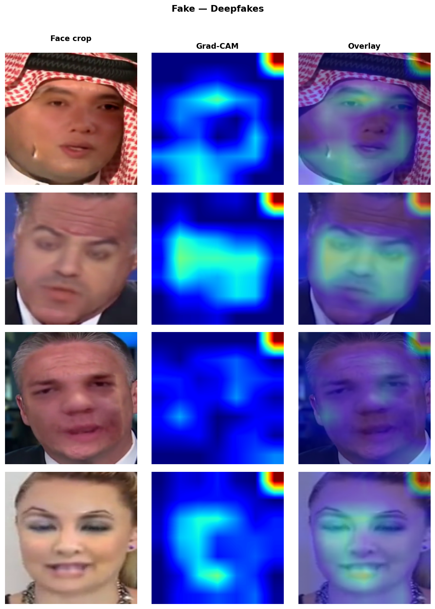
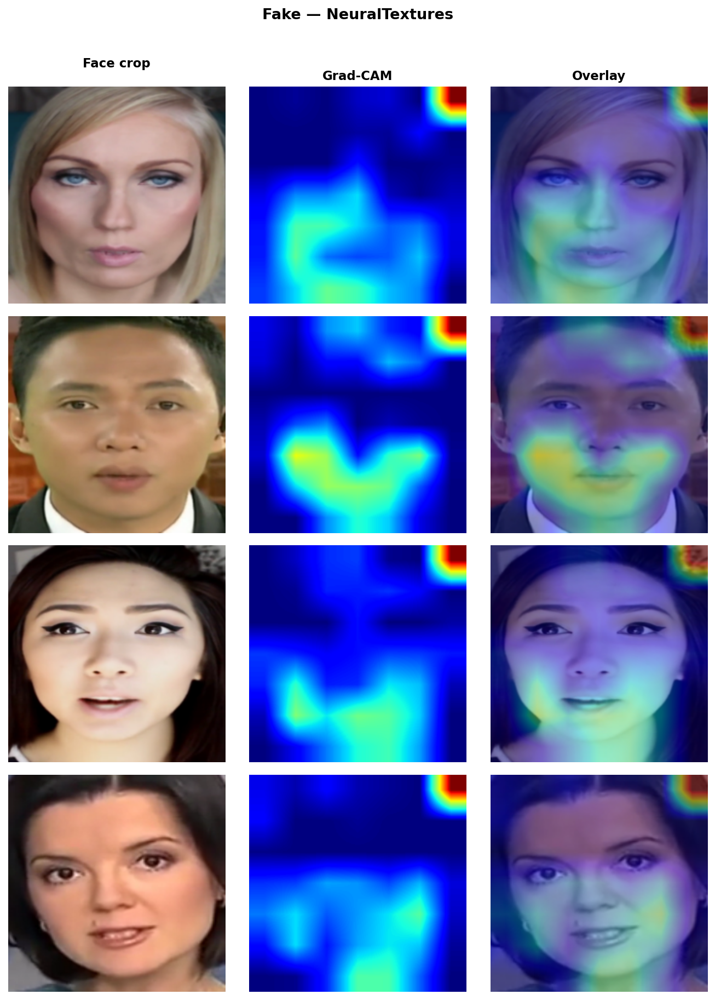

# FreqForensics

Deepfake detection by combining spatial and frequency-domain analysis. The model runs three parallel branches on each input face crop (one spatial with EfficientNet-B4 and two frequency branches built on the Haar wavelet transform) and fuses them with a learned cross-branch attention mechanism trained with a frequency debiasing objective.

Built as a solo project for the Signal Image and Video course, July 2026.

---

## Key findings

- The full triple-branch model reaches **AUC 0.927** on FaceForensics++ c23.
- A retrained spatial-only baseline (EfficientNet-B4 alone) reaches **AUC 0.954**, outperforming the full model by 2.7 points across all four forgery methods.
- Inference-time ablation confirms that the frequency branches do carry signal (removing them hurts FaceSwap and NeuralTextures in particular), but the frequency debiasing training recipe interferes with the spatial branch enough to offset the gain within-distribution.
- Grad-CAM visualisations show the model learning **method-specific attention patterns** that match the known artifact locations for each forgery type: face boundary for Deepfakes, mouth region for Face2Face, full face for NeuralTextures.

The gap between the two models points to a training recipe issue rather than an architectural one, and is itself the most interesting empirical result.

---

## Architecture

```
Input image (B, 3, 224, 224)
        |
        |---- Spatial Branch ---------> f_s  (B, 1792)
        |     EfficientNet-B4
        |     (ImageNet pretrained, blocks 0-5 frozen)
        |
        |---- Low-Freq Branch --------> f_lf (B, 256)
        |     Haar DWT -> LL + LL2 (two scales)
        |     3-layer CNN encoder
        |
        |---- High-Freq Branch -------> f_hf (B, 256)
              Haar DWT -> LH + HL + HH
              3-layer CNN encoder
                       |
             CrossBranchAttentionFusion
             (pairwise sigmoid attention gates, 6 directions)
                       |
             fused representation (B, 2304)
                       |
             ClassifierHead -> logit (B, 1)
```

### Haar DWT

The frequency decomposition is a fixed, parameter-free single-level 2D Haar transform. Applied as two sequential 1D convolutions with stride 2, it produces four half-resolution subbands from a grayscale input:

$$LL = \frac{1}{2}(X_{00} + X_{01} + X_{10} + X_{11}) \qquad \text{(coarse approximation)}$$

$$HH = \frac{1}{2}(X_{00} - X_{01} - X_{10} + X_{11}) \qquad \text{(diagonal details, GAN upsampling artifacts)}$$

The LF branch receives LL at two scales (level-1 and level-2, upsampled back to the same size and concatenated). The HF branch receives LH, HL, and HH stacked as a 3-channel input.

### Cross-branch attention fusion

Rather than simple concatenation, each branch attends to each other branch. For a query branch $a$ and a key-value branch $b$:

$$\alpha_{a \to b} = \sigma\!\left(Q_a(f_a) \cdot K_b(f_b)^T\right), \qquad f_a' = f_a + \alpha_{a \to b} \cdot V_b(f_b)$$

where $Q, K, V$ are learned linear projections to a common 128-d space and $\sigma$ is the sigmoid function. All six pairwise directions (s↔lf, s↔hf, lf↔hf) are computed, then the three attended vectors are concatenated into a 2304-d fused representation.

---

## Training recipe

### Fo-Mixup frequency augmentation

GAN-based generators leave spectral fingerprints tied to their upsampling architecture. A model that relies on these fingerprints will fail on unseen generators. To discourage this, each fake image is augmented by blending its DWT subbands with those of a random real image **in the frequency domain**:

$$\mathcal{F}(LL_{\text{aug}}) = \lambda \cdot \mathcal{F}(LL_{\text{fake}}) + (1-\lambda) \cdot \mathcal{F}(LL_{\text{real}})$$
$$\mathcal{F}(HH_{\text{aug}}) = \lambda \cdot \mathcal{F}(HH_{\text{fake}}) + (1-\lambda) \cdot \mathcal{F}(HH_{\text{real}})$$

with $\lambda \sim \text{Beta}(0.5, 0.5)$ sampled per image. Fo-Mixup is applied independently to LL (debiasing the LF branch) and HH (debiasing the HF branch), following the per-subband specialisation design.

### Loss function

$$L_{\text{total}} = L_{\text{BCE}} + 0.1 \cdot L_{\text{aux}} + 0.5 \cdot L_{\text{local}} + 0.5 \cdot L_{\text{global}}$$

- $L_{\text{BCE}}$: primary binary cross-entropy on the fused logit
- $L_{\text{aux}}$: sum of BCE losses on each branch's auxiliary head; prevents branch collapse
- $L_{\text{local}}$: L2 distance between Grad-CAM maps of an original fake and its Fo-Mixup version; forces spatially consistent attention
- $L_{\text{global}}$: vMF cosine dissimilarity between L2-normalised feature vectors of the same pair; forces representation consistency

$$L_{\text{local}} = \left\| \text{CAM}(x_{\text{fake}}) - \text{CAM}(x_{\text{aug}}) \right\|_2^2$$

$$L_{\text{global}} = 1 - \frac{f_{\text{fake}}}{\|f_{\text{fake}}\|} \cdot \frac{f_{\text{aug}}}{\|f_{\text{aug}}\|}$$

---

## Results

### ROC curves (95% bootstrap CI)


### Per-method AUC


### Ablation: full model vs spatial-only (retrained)


### Grad-CAM: where the model looks for each forgery method



---

## Repository structure

```
FreqForensics/
├── models/
│   ├── freqforensics.py      # Main model
│   ├── spatial_branch.py     # EfficientNet-B4 feature extractor
│   ├── lf_encoder.py         # Low-frequency CNN encoder
│   ├── hf_encoder.py         # High-frequency CNN encoder
│   ├── fusion.py             # Cross-branch attention fusion
│   ├── classifier_head.py    # Classification and auxiliary heads
│   ├── freq_transforms.py    # Haar DWT and subband builders
│   └── fo_mixup.py           # Fo-Mixup per-subband augmentation
├── training/
│   ├── config.py             # All hyperparameters in one place
│   ├── loss.py               # Composite loss
│   ├── sampler.py            # WeightedRandomSampler for class imbalance
│   └── trainer.py            # Training loop
├── data/
│   ├── dataset.py            # FFPPDataset
│   ├── build_index.py        # Build the master CSV index from FF++ splits
│   └── extract_frames.py     # Extract frames from .mp4 via ffmpeg
├── preprocessing/
│   ├── face_detector.py      # MTCNN face detection and landmark alignment
│   └── transforms.py         # Train/val augmentation pipelines
├── scripts/
│   ├── train.py              # Training entry point
│   ├── evaluate.py           # Test-set evaluation
│   └── run_ablation.py       # Inference-time branch ablation
├── evaluation/
│   └── metrics.py            # AUC, EER, AP, per-method metrics
└── visualisation/
    ├── plot_roc.py            # ROC curves with bootstrap CI
    ├── plot_metrics.py        # Per-method AUC and score distribution
    ├── plot_ablation.py       # Ablation charts
    └── gradcam_vis.py         # Grad-CAM grid figures
```

---

## Setup

```bash
pip install -r requirements.txt
```

Requires Python 3.10+, PyTorch 2.x, and FFmpeg installed system-wide.

---

## Data preparation

Download [FaceForensics++ c23](https://github.com/ondyari/FaceForensics), then:

```bash
# Extract every 10th frame
python data/extract_frames.py \
    --videos_root /path/to/FF++/c23 \
    --frames_root data/frames

# Build the split index CSV
python data/build_index.py \
    --splits_root /path/to/FF++/splits \
    --frames_root data/frames \
    --output      data/index.csv

# Detect faces and save 224x224 aligned crops
python scripts/preprocess_dataset.py \
    --index_csv  data/index.csv \
    --crops_root data/crops \
    --output_csv data/index_with_crops.csv
```

---

## Training and evaluation

```bash
# Train the full model
python scripts/train.py \
    --crops_csv  data/index_with_crops.csv \
    --output_dir checkpoints

# Train the spatial-only baseline
python scripts/train.py \
    --crops_csv   data/index_with_crops.csv \
    --output_dir  checkpoints_spatial_only \
    --spatial_only

# Evaluate and save results
python scripts/evaluate.py \
    --checkpoint checkpoints/best.pt \
    --crops_csv  data/index_with_crops.csv \
    --save_results results/test_run.npz

# Run inference-time ablation
python scripts/run_ablation.py \
    --checkpoint checkpoints/best.pt \
    --crops_csv  data/index_with_crops.csv

# Generate all plots
python visualisation/plot_roc.py     --results results/test_run.npz --bootstrap
python visualisation/plot_metrics.py --results results/test_run.npz --bootstrap
python visualisation/plot_ablation.py
python visualisation/gradcam_vis.py  --checkpoint checkpoints/best.pt \
                                      --crops_csv data/index_with_crops.csv
```

---

## References

- Durall et al. (2020). *Watch your Up-Convolution.* CVPR. [arXiv:2003.01826](https://arxiv.org/abs/2003.01826)
- Frank et al. (2020). *Leveraging Frequency Analysis for Deep Fake Image Recognition.* ICML. [arXiv:2003.08685](https://arxiv.org/abs/2003.08685)
- Kashiani et al. (2025). *FreqDebias.* CVPR. [arXiv:2509.22412](https://arxiv.org/abs/2509.22412)
- Luo et al. (2021). *Generalizing Face Forgery Detection with High-frequency Features.* CVPR. [arXiv:2103.12376](https://arxiv.org/abs/2103.12376)
- Qian et al. (2020). *F3Net.* ECCV. [arXiv:2007.09355](https://arxiv.org/abs/2007.09355)
- Rossler et al. (2019). *FaceForensics++.* ICCV. [arXiv:1901.08971](https://arxiv.org/abs/1901.08971)
- Shen et al. (2026). *Unveiling Deepfakes: A Frequency-Aware Triple Branch Network.* [arXiv:2604.17477](https://arxiv.org/abs/2604.17477)
- Vaswani et al. (2017). *Attention Is All You Need.* NeurIPS. [arXiv:1706.03762](https://arxiv.org/abs/1706.03762)
